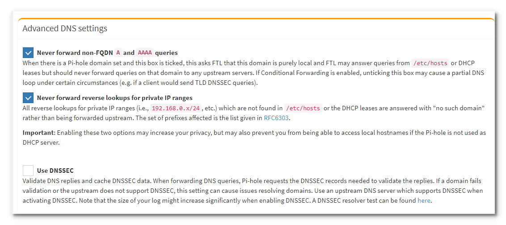

# dnscrypt-proxy-pihole

* [Overview](#overview)
* [Install](#install)
* [Uninstall](#uninstall)
* [Configuration](#configuration)
* [Check](#check)

## Overview
**Preconfigured deb package for every Raspberry Pi and Pi-hole to use only best DNSCrypt, DNS-over-HTTPS and No-Log servers. Optimised for Raspberry Pi OS 11 (bullseye) armhf (32bit).**

## Install
```bash
curl -sSfL https://raw.githubusercontent.com/mapi68/dnscrypt-proxy-pihole/master/dnscrypt-proxy-pihole-install | bash
```
## Uninstall
```bash
sudo apt --purge remove dnscrypt-proxy-pihole -y
```


## Configuration




## Check
Check if dnscrypt-proxy-pihole works and resolves DNS names:
```bash
tail -f -n 20 /var/log/dnscrypt-proxy/query.log
```
Check server with the lowest initial latency:
```bash
sed -i '/dnscrypt-proxy/d' /var/log/syslog && cat /var/log/syslog | grep dnscrypt-proxy
```


[DNSSEC Resolver Test](https://dnssec.vs.uni-due.de)
