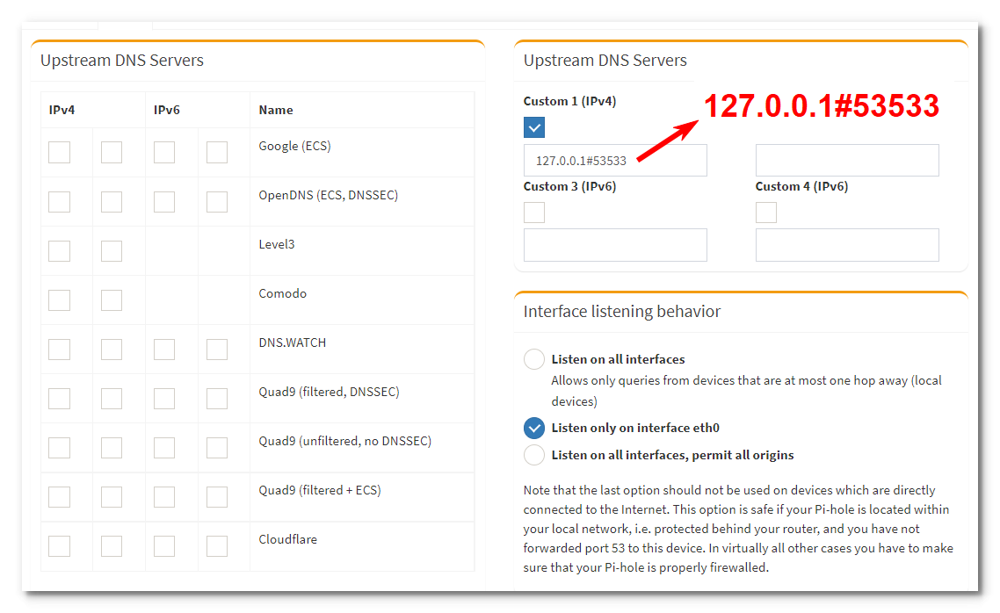
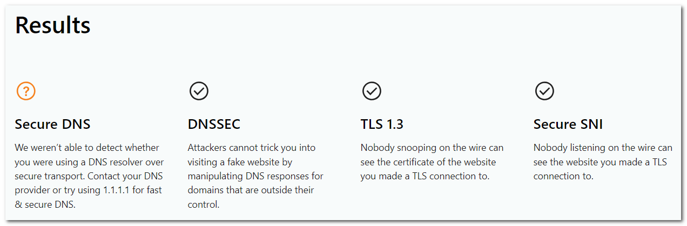

# 🛡️ dnscrypt-proxy-pihole

<div align="center">
  
  [](https://opensource.org/licenses/MIT)
  [](https://pi-hole.net/)
  [](https://www.raspberrypi.org/)
  
  <p>
    
    
    
  </p>
  
  <br/>
  <h3>📢 Secure DNS solution for your Raspberry Pi & Pi-hole setup</h3>
  
</div>

---

## 📋 Table of Contents

<div align="center">
  
  [🔍 Overview](#overview) • 
  [🚀 Install](#install) • 
  [🗑️ Uninstall](#uninstall) • 
  [⚙️ Configuration](#configuration) • 
  [🔐 Check](#check)
  
</div>

---

## 🔍 Overview {#overview}

<div class="feature-box" align="center">
  <table>
    <tr>
      <td align="center">
      <h3>🔒 Preconfigured Security Package for Raspberry Pi</h3>
      </td>
    </tr>
  </table>
</div>

<br/>

<div class="version-box">
  <h4>📌 Version Compatibility:</h4>
  
  ⚠️ **DEPRECATED:** [Raspberry Pi OS 11 (bullseye)](https://github.com/mapi68/dnscrypt-proxy-pihole/raw/refs/heads/master/dnscrypt-proxy-pihole_bullseye_armhf.deb)
  > Historical note: Raspberry Pi OS 11 used DNS server at `127.0.0.1#53533`
  
  ✅ **SUPPORTED:** [Raspberry Pi OS 12 (bookworm)](dnscrypt-proxy-pihole_latest_armhf.deb)
  > Current version works with Pi-hole v6 using DNS server at `127.0.0.1#5335`
  
  📋 **Platform support:** armhf (32-bit) architecture only
</div>

<br/>

<div class="feature-list" align="center">
  <table>
    <tr>
      <td>✨ <b>Enhanced Security</b></td>
      <td>Top-tier DNSCrypt & DNS-over-HTTPS integration</td>
    </tr>
    <tr>
      <td>🕵️ <b>Privacy Protection</b></td>
      <td>No-Log DNS servers by default</td>
    </tr>
    <tr>
      <td>⚡ <b>Performance</b></td>
      <td>Optimized for Raspberry Pi hardware</td>
    </tr>
    <tr>
      <td>🔌 <b>Easy Setup</b></td>
      <td>Pre-configured for immediate use with Pi-hole</td>
    </tr>
  </table>
</div>

---

## 🚀 Install {#install}

<div align="center">
  <p>One-command installation:</p>
  
  ```bash
  curl -sSfL https://raw.githubusercontent.com/mapi68/dnscrypt-proxy-pihole/master/dnscrypt-proxy-pihole-install | bash
  ```
  
  <p><i>The script handles all dependencies and configuration automatically</i></p>
</div>

---

## 🗑️ Uninstall {#uninstall}

<div align="center">
  <p>Remove completely with:</p>
  
  ```bash
  sudo apt --purge remove dnscrypt-proxy-pihole -y
  ```
</div>

---

## ⚙️ Configuration {#configuration}

### Pi-hole Settings

<div align="center">
  <table>
    <tr>
      <td align="center">
        
        <br/>
        <em>Configure Pi-hole to use local DNS at port 5335</em>
      </td>
    </tr>
  </table>
</div>

<div class="config-box">
  <h4>🔧 Required Configuration:</h4>
  
  - **DNS Server:** `127.0.0.1#5335` for Pi-hole v6
  - **DNSSEC:** Disable DNSSEC in Pi-hole settings (handled by dnscrypt-proxy)
  - **Important:** Make sure "Use DNSSEC" option in Pi-hole is turned OFF
</div>

---

## 🔐 Check {#check}

<div class="check-box">
  <h4>📊 Verification Methods:</h4>
  
  <h5>Check DNS resolution:</h5>
  
  ```bash
  tail -f /var/log/dnscrypt-proxy/query.log
  ```
  
  <h5>Check server with the lowest initial latency:</h5>
  
  ```bash
  journalctl -f -u dnscrypt-proxy
  ```
</div>

<div align="center">
  <table>
    <tr>
      <td align="center">
        
        <br/>
        <em>Successful DNSSEC Validation</em>
      </td>
    </tr>
  </table>
</div>

<div align="center">
  <h3>🌐 <a href="https://www.cloudflare.com/ssl/encrypted-sni">Test Your Browsing Security</a></h3>
  <p><i>Verify that your DNS setup is working correctly</i></p>
</div>

---

<div align="center">
  <p>Made with ❤️ for the Raspberry Pi & Pi-hole community</p>
</div>
