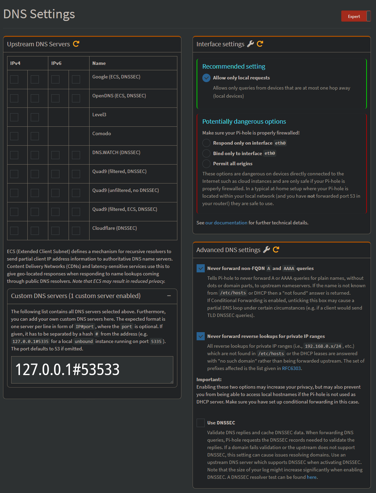
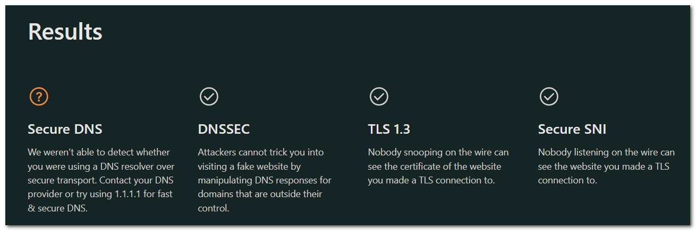

# 🛡️ dnscrypt-proxy-pihole

<div align="center">

  [](https://opensource.org/licenses/MIT)
  [](https://pi-hole.net/)
  [](https://www.raspberrypi.org/)

  <p>
    
    
    
  </p>

  <br/>
  <h3>📢 Secure DNS solution for your Raspberry Pi & Pi-hole setup</h3>
  <p>Enhanced DNS encryption and privacy for Pi-hole with pre-configured settings</p>

</div>

---

## 📋 Table of Contents

<div align="center">

  [🔍 Overview](#overview) •
  [✨ Features](#features) •
  [🚀 Install](#install) •
  [📜 Scripts](#scripts) •
  [⚙️ Configuration](#configuration) •
  [🔐 Verification](#verification) •
  [🗑️ Uninstall](#uninstall) •
  [❓ FAQ](#faq)

</div>

---

## 🔍 Overview <a name="overview"></a>

A preconfigured DNSCrypt-proxy package for Raspberry Pi and Pi-hole users that ensures secure, encrypted DNS queries through carefully selected DNSCrypt and DNS-over-HTTPS servers with strict no-logging policies.

### 🎯 Key Benefits

- Encrypts all DNS queries for enhanced privacy
- Protects against DNS spoofing and MITM attacks
- Seamless integration with Pi-hole
- Pre-configured for optimal security and performance

### 📦 Compatibility

✅ **CURRENT VERSION:**
- [Raspberry Pi OS 13 (trixie 64bit)](https://github.com/mapi68/dnscrypt-proxy-pihole/raw/refs/heads/master/dnscrypt-proxy-pihole_latest_arm64.deb)
- [Raspberry Pi OS 12 (bookworm 32bit)](https://github.com/mapi68/dnscrypt-proxy-pihole/raw/refs/heads/master/dnscrypt-proxy-pihole_latest_armhf.deb)
- Pi-hole v6.0+
- DNS server: `127.0.0.1#53533`

⚠️ **LEGACY VERSION:**
- [Raspberry Pi OS 11 (bullseye)](https://github.com/mapi68/dnscrypt-proxy-pihole/raw/refs/heads/master/dnscrypt-proxy-pihole_bullseye_armhf.deb)

## ✨ Features <a name="features"></a>

<div align="center">
  <table>
    <tr>
      <th>Feature</th>
      <th>Description</th>
      <th>Benefit</th>
    </tr>
    <tr>
      <td>🔒 DNSCrypt</td>
      <td>Advanced DNS encryption</td>
      <td>Protects against DNS surveillance</td>
    </tr>
    <tr>
      <td>🌐 DNS-over-HTTPS</td>
      <td>Modern DNS protocol support</td>
      <td>Additional security layer</td>
    </tr>
    <tr>
      <td>🕵️ Privacy Focus</td>
      <td>No-log DNS servers only</td>
      <td>Ensures query privacy</td>
    </tr>
    <tr>
      <td>🛡️ DNSSEC</td>
      <td>Built-in validation</td>
      <td>Prevents DNS spoofing</td>
    </tr>
    <tr>
      <td>⚡ Optimized</td>
      <td>Raspberry Pi tuned</td>
      <td>Efficient resource usage</td>
    </tr>
  </table>
</div>

## 🚀 Install <a name="install"></a>

### Quick Install
```bash
curl -sSfL https://raw.githubusercontent.com/mapi68/dnscrypt-proxy-pihole/master/dnscrypt-proxy-pihole-install | bash
```

### Manual Installation
```bash
# Download latest package
wget https://github.com/mapi68/dnscrypt-proxy-pihole/raw/master/dnscrypt-proxy-pihole_latest_$(dpkg --print-architecture).deb

# Install package
sudo dpkg -i dnscrypt-proxy-pihole_latest_$(dpkg --print-architecture).deb

# Install dependencies if needed
sudo apt-get install -f
```

## 📜 Scripts <a name="scripts"></a>

### 1. `install-latest-dnscrypt-proxy.bash`

<div class="script-box">
  <h4>🔄 Automated Installer</h4>

  Downloads and installs the latest dnscrypt-proxy package from official Debian repositories.

  **Features:**
  - Auto-detects system architecture
  - Downloads latest version from Debian repos
  - Handles all dependencies
  - Multi-architecture support (amd64, arm64, armhf, ...)

  **Usage:**
  ```bash
  ./install-latest-dnscrypt-proxy.bash
  # Or specify architecture:
  ./install-latest-dnscrypt-proxy.bash armhf
  ```
</div>

### 2. `dnscrypt-proxy-pihole.bash`

<div class="script-box">
  <h4>🔧 Configuration Script</h4>

  Sets up DNSCrypt-proxy for optimal use with Pi-hole.

  **Features:**
  - Configures secure DNS settings
  - Sets up port 53533 for Pi-hole
  - Enables DNSSEC validation
  - Configures no-logging policy
  - Optimizes caching

  **Usage:**
  ```bash
  sudo ./dnscrypt-proxy-pihole.bash
  ```
</div>

### Installation Methods

<div align="center">
  <table>
    <tr>
      <th>Method</th>
      <th>Description</th>
      <th>When to Use</th>
    </tr>
    <tr>
      <td><code>dnscrypt-proxy-pihole-install</code></td>
      <td>Installs pre-configured package</td>
      <td>For quick, automated setup</td>
    </tr>
    <tr>
      <td><code>install-latest-dnscrypt-proxy.bash</code></td>
      <td>Installs vanilla dnscrypt-proxy from Debian repos</td>
      <td>For custom installations</td>
    </tr>
    <tr>
      <td><code>dnscrypt-proxy-pihole.bash</code></td>
      <td>Configures dnscrypt-proxy for Pi-hole</td>
      <td>After manual installation</td>
    </tr>
  </table>
</div>

## ⚙️ Configuration <a name="configuration"></a>

### Pi-hole Setup

1. Access Pi-hole admin interface
2. Navigate to Settings → DNS
3. Configure:
   - Set Custom DNS: `127.0.0.1#53533`
   - Disable DNSSEC (handled by DNSCrypt)

<div align="center">
  <table>
    <tr>
      <td align="center">
        
        <br/>
        <em>Pi-hole DNS Configuration</em>
      </td>
    </tr>
  </table>
</div>

### Important Files
- Configuration: `/etc/dnscrypt-proxy/dnscrypt-proxy.toml`
- Query Log: `/var/log/dnscrypt-proxy/query.log`
- Service: `/lib/systemd/system/dnscrypt-proxy.service`

## 🔐 Verification <a name="verification"></a>

### System Checks

1. **DNS Resolution:**
```bash
tail -f /var/log/dnscrypt-proxy/query.log
```

2. **Service Status:**
```bash
journalctl -f -u dnscrypt-proxy
```

3. **DNSSEC Test:**
```bash
dig +dnssec google.com @127.0.0.1 -p 53533
```

<div align="center">
  <table>
    <tr>
      <td align="center">
        
        <br/>
        <em>Successful DNSSEC Validation</em>
      </td>
    </tr>
  </table>
</div>

### Online Tests
- [DNSLeakTest](https://www.dnsleaktest.com)
- [Cloudflare ESNI Check](https://www.cloudflare.com/ssl/encrypted-sni)

## 🗑️ Uninstall <a name="uninstall"></a>

Remove completely with:
```bash
sudo apt --purge remove dnscrypt-proxy-pihole -y
```

## ❓ FAQ <a name="faq"></a>

**Q: Why use this with Pi-hole?**
- Adds DNS encryption to Pi-hole's ad-blocking capabilities

**Q: Performance impact?**
- Minimal; optimized for Raspberry Pi

**Q: Custom DNS servers?**
- Edit `/etc/dnscrypt-proxy/dnscrypt-proxy.toml`

**Q: Update procedure?**
- Run `install-latest-dnscrypt-proxy.bash`
